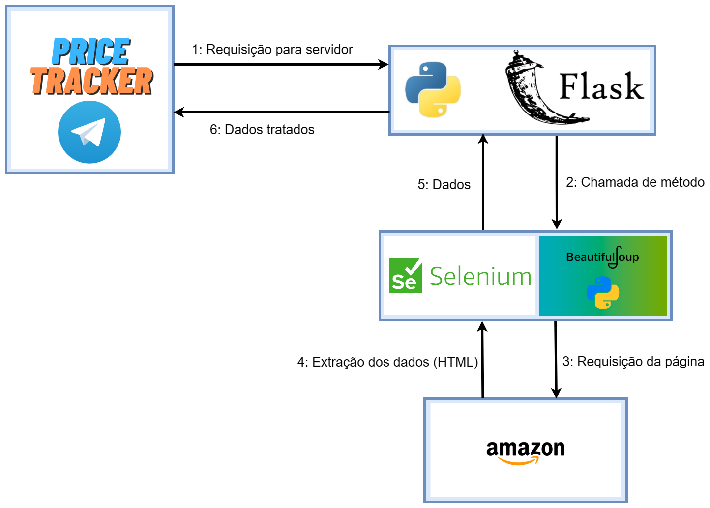

Repositório criado para o projeto final da disciplina de Sistemas Distribuidos

# Price Tracker

Este trabalho consiste em um BOT para telegram que supervisionará anúncios de sites de e-commerce ([AMAZON](https://www.amazon.com.br/ref=nav_logo)), onde será possível enviar o link de um anúncio, e o bot cadastrará o produto para checagem dos preços.

A coleta de dados será feita através de Web Scraping ([Selenium](https://www.selenium.dev/)) e ([BeautifulSoup](https://beautiful-soup-4.readthedocs.io/en/latest/)) através de um sistema de requisições utilizando ([Flask](https://flask.palletsprojects.com/en/2.2.x/)), em que será possível checar os preços dos produtos cadastrados por cada usuário.

Para o cadastro de um produto basta enviar o comando `/link` juntamento com o link de um produto da Amazon, como por exemplo: `/link` https://www.amazon.com.br/seu-produto.

Para verificar os preços dos produtos cadastradros basta utilizar o comando `/produtos`, que retornará todos os produtos cadastrados para aquele usuário.

## Arquitetura

## Fluxo geral

* Apos o envio do comando `/link`, primeiramente é requisitado para o servidor utilizando HTPPS e o método GET através de um __endpoint__, que então chamará o método do Selenium, que carregará a página solicitada, que terá seus dados coletados pelo BeautifullSoup.

* Após a coleta dos dados, os dados são retornados ao servidor e então ao TelegramBot utilizando HTTPS.

* Usando o comando `/produtos`, é possível ver uma lista dos produtos cadastrados anteriormente.

## Endpoints do Servidor

### `/cadastraproduto`

É responsável pelo cadastro do produto através do ID do chat do usuário, registrando ID, NOME DO PRODUTO, LINK e PREÇO.

### `/verificaproduto`

É responsãvel por verificar se um produto já está cadastrado ou não, a verificação ocorre por ID de usuário e link do produto.

### `/retornaprodutos`

É responsável por listar os produtos cadastrados de um usuário. Vale ressaltar que os produtos cadastrados também terão seus preços atualizados e será indicado caso o produto esteja com desconto em seu valou.
